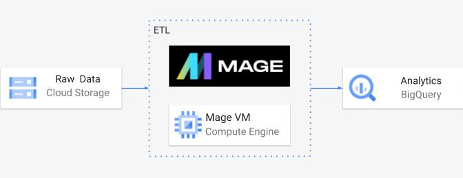

# Uber Data Engineering | ETL GCP Project

## Introduction

The goal of this project is to create an ETL pipeline for Uber data using various tools and technologies, including GCP Storage, Python, Compute Instance, Mage Data Pipeline Tool and BigQuery(SQL).

## Project Architecture 

## Technology Used
- Programming Language - Python

- SQL

- Google Cloud Platform
  1. Google Storage
  2. Compute Instance 
  3. BigQuery

- Mage: Modern Data Pipeline Tool that provides ETL script templates - https://www.mage.ai/
Contribute to this open source project - https://github.com/mage-ai/mage-ai

## Dataset
TLC Trip Record Data
Yellow and green taxi trip records include fields capturing pick-up and drop-off dates/times, pick-up and drop-off locations, trip distances, itemized fares, rate types, payment types, and driver-reported passenger counts. 

Website for the dataset: https://www.nyc.gov/site/tlc/about/tlc-trip-record-data.page

Dictionary for the dataset:  https://www.nyc.gov/assets/tlc/downloads/pdf/data_dictionary_trip_records_yellow.pdf

## Data Model:

Relational Database:

-The main table, which contains most of the useful information.

-Two tables provided as unnecessary examples of metadata repositories.
